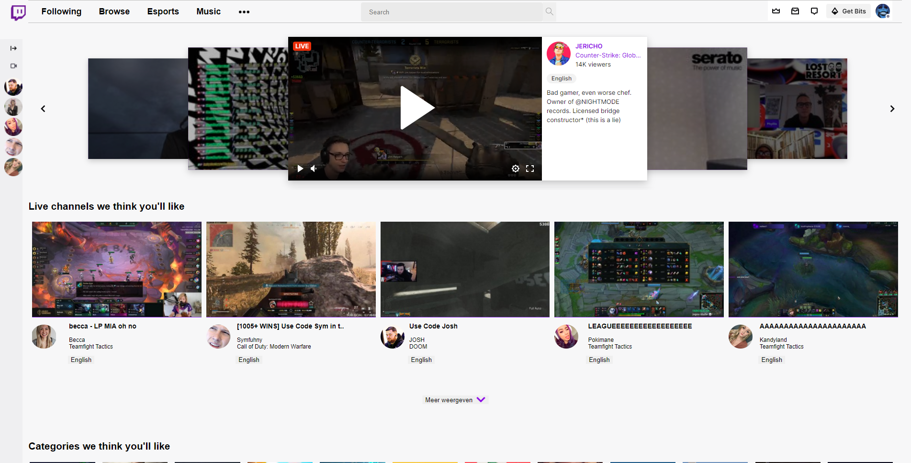

# Procesverslag
**Auteur: Alexander Plet

Markdown cheat cheet: [Hulp bij het schrijven van Markdown](https://github.com/adam-p/markdown-here/wiki/Markdown-Cheatsheet). Nb. de standaardstructuur en de spartaanse opmaak zijn helemaal prima. Het gaat om de inhoud van je procesverslag. Besteedt de tijd voor pracht en praal aan je website.

In week 1 t/m week 3 heb ik zitten werken aan de opzet van mijn website dat ik ga namaken. Het gaat om de website twitch.tv. Deze website heb ik gekozen omdat ik best veel tijd besteed op
die platvorm voor kijkvermaak. Aan het einde van week 3 ben ik samen met wat klasgenoten gespreksinhoud verzameld voor het voortgangsgesprek van week 3. Dit ging soepel en iedereen kon
een probleem opnoemen wat tijdens het gesprek dan ter sprake zou komen.
Tussen week 4 en 5 heb ik eerlijk gezegd heel minimaal gewerkt en had ik daarom dus maar 1 probleempunt genoemd voor tijdens het voorgangsgesprek van week 5.
In Week 6 heb ik niets gedaan aan de website en was ik eerlijk gezegd ook niet aanwezig toen i.v.m shock dat een familielid van mij vastgesteld was met corona. Daarom was mijn focus op die dag daaraan. Dit had ik niet gemeld omdat ik dat een moeite vond en het te veel op een smoesjes leek vandaar dat ik niets had gezegd.
Week 7 & 8 had ik mijn tijd besteed aan het maken van de opdrachten van de vakken Vormgeving 2 & Project Web, daarom heb ik niets gedaan aan frontened. Heel slecht ik weet het. Motivatie zat echt laag op een of andere manier.
Week 9, ik had gevraagd of ik gelijk naar de herkansing kon gaan. In die week heb ik gewerkt aan de website en zag in hoe moeilijk de gekozen website eingelijk is om na te maken.
Ik heb daarom ook wel een beetje moeten cheaten om het geloofwaardig te maken. Niet alles is uitgewerkt, omdat het grofweg te moeilijk was of omdat het niet allemaal nodig is en het dan te veel werk zal kosten.
Ik heb opzich wel veel geleerd over wat er allemaal te vinden is qua hulpbronnen en de manier van hoe code gedaan kan worden zonder javascript.
Dus dat zal ik sowieso meenemen naar de toekomstige opdrachten in deze richting.

Conclusie:

Te weinig gedaan toen er veel tijd was, waardoor er aan het einde veel aan gewerkt moest worden. En aan het einde kwam ik er echt achter hoe lastig sommige elementen waren om te coderen.

## Bronnenlijst
1. <a href="https://www.w3schools.com/">w3schools</a>
2. <a href="http://www.onlinewebfonts.com">oNline Web Fonts</a>
3. <a href="https://codepen.io/Axiol/pen/QWLRMVr">codepen</a>
4. <a href="https://dev.twitch.tv/docs/embed/everything">twitch dev</a>
5. <a href="twitch.tv">twitch.tv</a>
6. <a href="https://stackoverflow.com/questions/49934826/how-to-open-sub-menu-with-onclick-function-and-hide-with-onclick-function">stackoverflow</a>

## Eindgesprek (week 7/8)

-dit ging goed & dit was lastig-

**Screenshot(s):**

## Voortgang 3 (week 6)

Niet verder gewerkt

## Voortgang 2 (week 5)

-same as voortgang 1-

-dit ging goed & dit was lastig-

box shadow met image animeren zijwaards naar boven toe. weet niet hoe dat moet

### Agenda voor meeting 2

-samen met je groepje opstellen-

    Voortgang gesprek planning
- max width bij grid toepassen
- de pagina refresged wanneer de pop-up wordt afgesloten
- image on hover naar rechtsboven laten bewegen in animatie

## Voortgang 1 (week 3)

### Stand van zaken

-dit ging goed & dit was lastig-

Naarmate van de lesstof heb ik een beetje gewerkt met flexbox en de standaard html elementen voor een basisopzet

**Screenshot(s):**

-screenshot(s) van hoe ver je bent-

### Agenda voor meeting

-samen met je groepje opstellen-

Voortgang gesprek planning
- Flexbox; blokken naast elkaar zetten
- Pannenkoeken menu; als er op de website een is, mag je die dan namaken of moet je een andere oplossing bedenken?
- Java; 360 turn
- let keyword javascript
- zoekbalk in navigatie

### Verslag van meeting

-na afloop snel uitkomsten vastleggen-

## Intake (week 1)

**Je startniveau:** -kies uit zwart, rood óf blauw-

- Rood

**Je focus:** -kies uit responsive óf surface plane-

- Responsive

**Je opdracht:** -link naar de website die je gaat namaken óf de naam van je eigen ontwerp-

- 

**Screenshot(s):**

**Breakdown-schets(en):**

