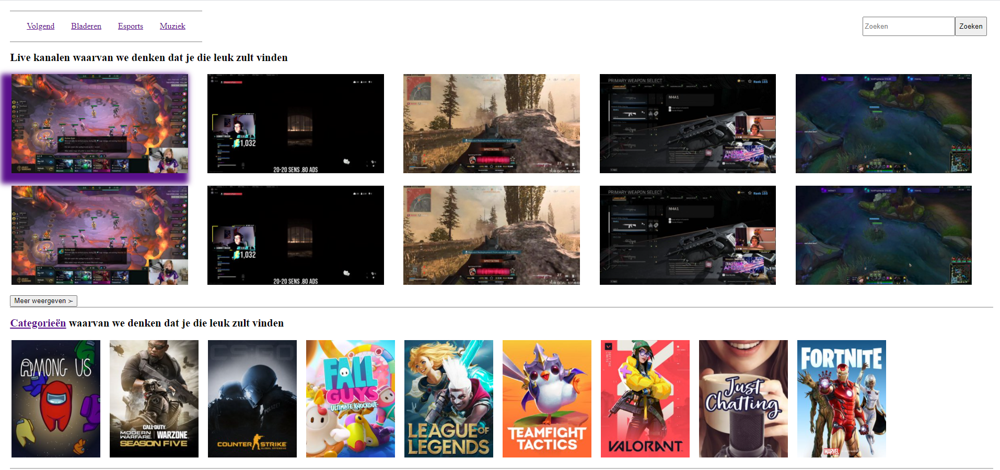
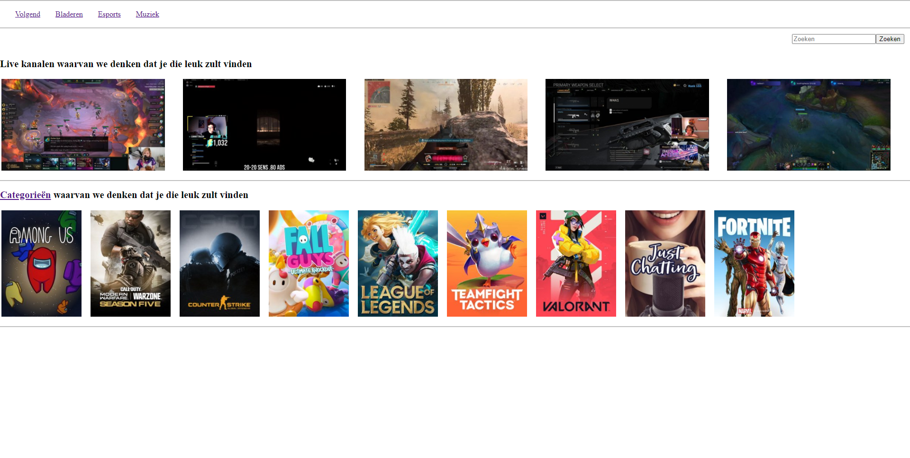
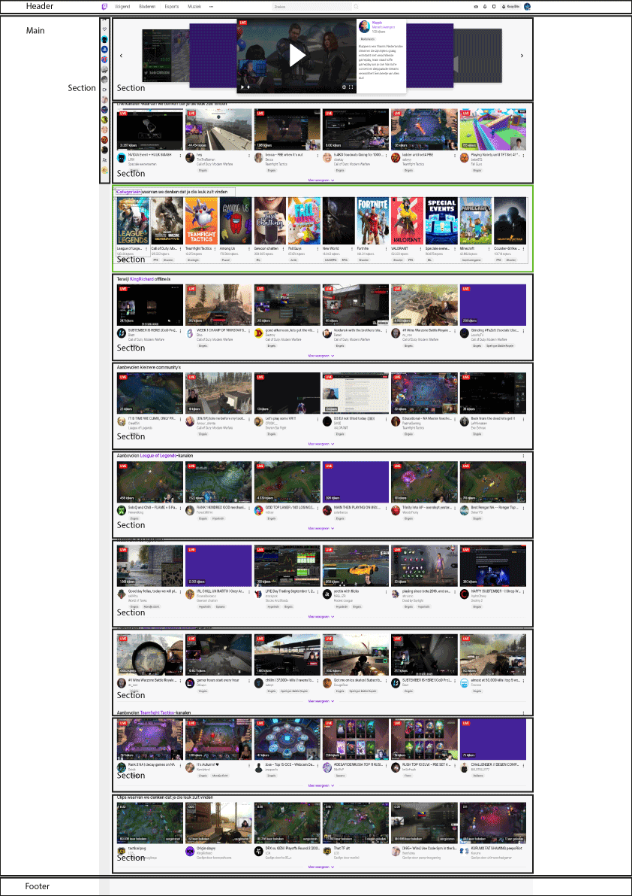

# Procesverslag
**Auteur: Alexander Plet

Markdown cheat cheet: [Hulp bij het schrijven van Markdown](https://github.com/adam-p/markdown-here/wiki/Markdown-Cheatsheet). Nb. de standaardstructuur en de spartaanse opmaak zijn helemaal prima. Het gaat om de inhoud van je procesverslag. Besteedt de tijd voor pracht en praal aan je website.

## Bronnenlijst
1. 
2. <a href="http://www.onlinewebfonts.com">oNline Web Fonts</a>
3. 

## Eindgesprek (week 7/8)

-dit ging goed & dit was lastig-

**Screenshot(s):**

-screenshot(s) van je eindresultaat-

## Voortgang 3 (week 6)

Niet verder gewerkt

## Voortgang 2 (week 5)

-same as voortgang 1-

-dit ging goed & dit was lastig-

box shadow met image animeren zijwaards naar boven toe. weet niet hoe dat moet

### Agenda voor meeting 2

-samen met je groepje opstellen-

    Voortgang gesprek planning
- max width bij grid toepassen
- de pagina refresged wanneer de pop-up wordt afgesloten
- image on hover naar rechtsboven laten bewegen in animatie

## Voortgang 1 (week 3)

### Stand van zaken

-dit ging goed & dit was lastig-

Naarmate van de lesstof heb ik een beetje gewerkt met flexbox en de standaard html elementen voor een basisopzet

**Screenshot(s):**

-screenshot(s) van hoe ver je bent-

### Agenda voor meeting

-samen met je groepje opstellen-

Voortgang gesprek planning
- Flexbox; blokken naast elkaar zetten
- Pannenkoeken menu; als er op de website een is, mag je die dan namaken of moet je een andere oplossing bedenken?
- Java; 360 turn
- let keyword javascript
- zoekbalk in navigatie

### Verslag van meeting

-na afloop snel uitkomsten vastleggen-

## Intake (week 1)

**Je startniveau:** -kies uit zwart, rood óf blauw-

- Rood

**Je focus:** -kies uit responsive óf surface plane-

- Responsive

**Je opdracht:** -link naar de website die je gaat namaken óf de naam van je eigen ontwerp-

- 

**Screenshot(s):**

**Breakdown-schets(en):**

